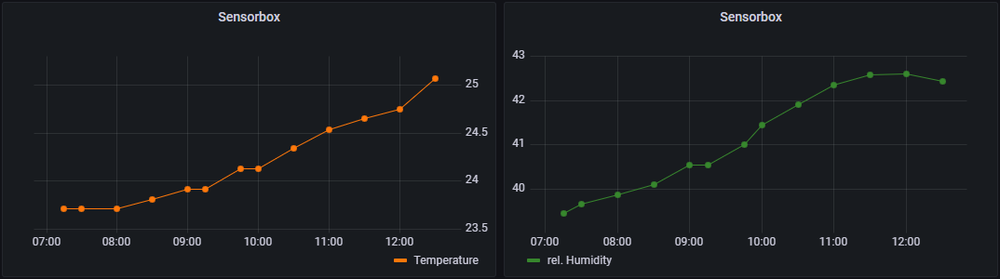

# RHT Sensor Box
## A Little sensor which sends data every 30 minutes to graphite
A typical weekend project
<p align="middle">
  
  
  
</p>

## Features
- RHT sensor
- 2x AAA battery
- 0.49" OLED Display
- Button for showing current values
- 30 minutes logging interval
- sends the data to graphite
- batteries should last at least 1 year

## Usage
- Rename the file ```src/config.sample.h``` to ```config.h``` and fill in your settings!

## Pictures
<p align="middle">
  
  
  
  
  
  
  
  
  
  
  
  
  
  
</p>