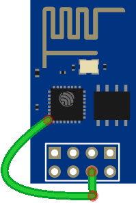
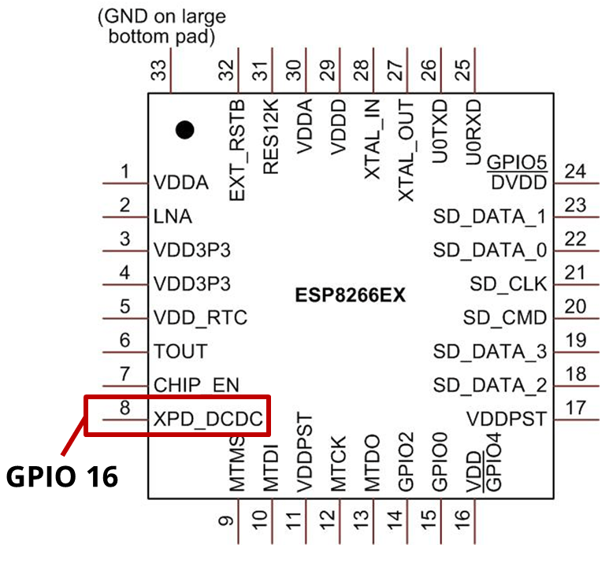

# RHT Sensor Box
## A Little sensor which sends data every 30 minutes to graphite
A typical weekend project
<p align="middle">
  
  
  
</p>

## Features
- RHT sensor
- 2x AAA battery
- 0.49" OLED Display
- Button for showing current values
- 30 minutes logging interval
- sends the data to graphite

## Power consumption
For the calculation I assumed 2000mAh with 20% discharge safety.
Typical capacity of a single LR03 battery from Varta is about [1220mAh](https://www.farnell.com/datasheets/39630.pdf), so I went a bit lower.

- OFF Time:
	- overall deep-sleep current is about 20uA
	- 1800 seconds sleeping (30mins)
- ON Time:
	- worst case is about 10 seconds when the device couldn't connect to WiFi
	- best case is max. 4 seconds
	- current drain is about 70mA

Using the above parameters, we come to the following results:
| Best Case | Worst Case |
|-----------|------------|
| 380 days  | 163 days   |

A butten press, which also triggers a little OLED Display, is not considered.

## Usage
- Rename the file ```src/config.sample.h``` to ```config.h``` and fill in your settings!

## Hardware Mod
If you are also using a ESP-01 module, you need to connect GPIO16 with a bodge wire to the RESET Pin.
<p align="left">
  
  
</p>

## Pictures
<p align="left">
  
  
  
  
  
  
  
  
  
  
  
  
  
</p>